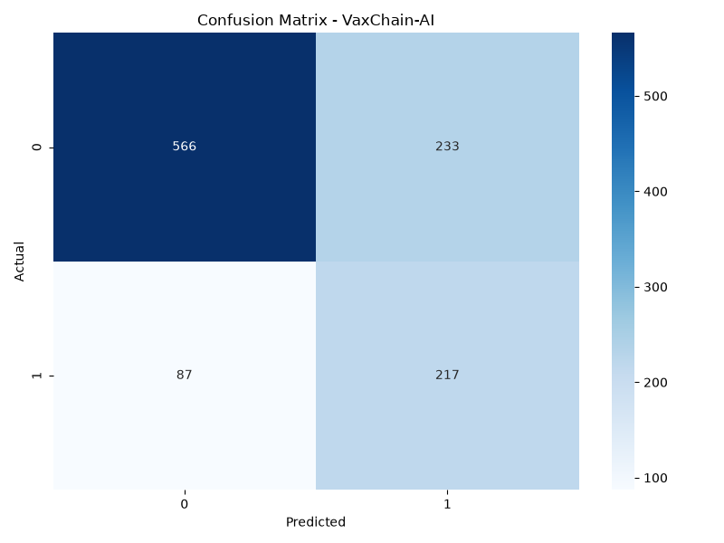

# VaxChain-AI: Predictive Risk Engine for Vaccine Stockouts & Cold Chain Failures in Nigerian LGAs

**Focus: North West Nigeria (Kano, Katsina, and Jigawa LGAs)**

**VaxChain-AI** is a machine learning risk engine developed for the **3MTT x IndentArk AI Hackathon Challenge** with the theme *"Build AI. Solve Local."*. The platform shifts last-mile immunization delivery from a reactive system to a predictive one, helping intercept infrastructure failures across high-burden Local Government Areas within the Kano Electricity Distribution Company (KEDCO) operational footprint.

---

## Problem Statement

The North West geopolitical zone bears the heaviest immunization burden and the highest concentration of zero-dose children in Nigeria.

For this demonstration, VaxChain-AI focuses on the region by modelling the infrastructure network of **KEDCO** (covering Kano, Katsina, and Jigawa states).

Primary Health Centers (PHCs) in those states form the backbone of childhood immunization delivery but face severe localized challenges:

- **Power Grid Outages**: Frequent load shedding on KEDCO lines cause ice-lined equipment to experience dangerous temperature rises.
- **Transit Latency**: Remote rural PHCs often run out of essential vaccines long before the next restocking arrives.

---

## Data Strategy & Architecture

Due to security restrictions on live government systems, VaxChain-AI utilized an "Anchored Domain Synthesis** approach:

- **Spatial Backbone**: Uses exact latitide and longitude data of PHCs from **GRID3 Nigeria**
- **Logistics Schema**: Structured according to official **DHIS2** and **OpenLMIS** parameters.
- **Energy Simulation**: Generates localized power availability scores based on **NERC's** KEDCO territory performance metrics.

---

## Repository Structure

1. **data_engine.py:**                Ingest GRID3 data and generate KEDCO franchise logs
2. **machine_learning.py:**           Train ML model and perform LGA-level aggrgations
3. **app.py:**                        Stramlit interactive geospatial dashboard
4. **requirements.txt:**              Python dependencies
5. **README.md:**                     Project documentation

---

## Project Execution Guide

### 1. Clone the Repository

'''bash
git clone <https://github.com/nnamdiezeogu/VaxChain-AI-Predictive-Risk-Engine-for-Vaccine-Stockouts-Cold-Chain-Failures-in-Nigerian-LGAs.git>
cd vaxchain-ai
'''

### 2. Install Dependencies

Ensure Python 3.9+ is installed, then run:
'''bash
pip install -r requirements.txt
'''

### 3. Generate the Data

'''bash
python data_engine.py
'''
*This creates 'filtered_phc_vax_ledger.csv'*

### 4. Train the Predictive Model

'''bash
python machine_learning.py
'''
*This creates 'vaxcahin_rf_model.pkl' and 'lga_dashboard_map_data_csv'*

### 5. Lunch the Dashboard

'''bash
python -m streamlit run app.py
'''

---

## Model Performance

The predictive model was trained using a Random Forest Classifier with class weighting to handle data imbalance.

### Results (Test Set)

**Metric**                  **Score**

- Accuracy                      71%
- Recall (Stockout Class)       71%
- Precision (stockout Class)    48%
- f1-score (Stockout Class)     58%

**Confusion Matrix Analysis**

**Key Insight**:

Using a balanced class weighting improved the model's ability to detect actual stockouts and cold chain failures. Further, the model proved good at detecting real problems (217 out of 304 actual stockouts or 71% recall). However, there is still a high number of false alarms (233), even though it correctly identified 566 normal situations.

### Why the Results Matter

The model's current performance reflects two important limitaions of the prototype:

1. **Small Sample Size**: Limited training and testing data, solely for proof-of-concept demonstration purposes.
2. **Synthetic Data**: The model was trained on anchored synthetic data generated from publicly available sources due to restricted access to live government systems including DHIS2 and OpenLMIS, and real-time KEDCO power data.

### Potential

With access to real-world data (larger historical vaccine stock levels, cold cahin temperature logs, and real power outage records) this architecture is expected to scale significantly and deliver stronger predictive performance suitable for operational deployment.
